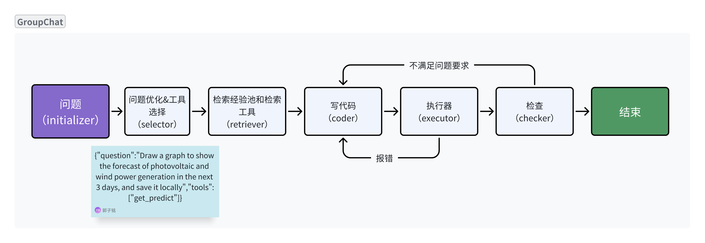

### AutoGen Data Interpreter (DI) 

Implemented in autoGen's GroupChat framework with reference to metaGPT's Data Interpreter module, with minor modifications to include tool recommendation and experience pool retrieval.




1. **Environment Setup**
   - Create a `.env` file in the root directory to store the API key.
   - Add the following content to the file:
     ```
     OPENAI_API_KEY=sk-xxxxxxxx
     ```
   - Install the required Python libraries:
     ```bash
     pip install python-dotenv requests faiss numpy
     ```

2. **Functionality Overview**
   - `get_embedding(text, model)`: This function retrieves embeddings for a given text using a specified model.
   - `search_answer(question, index, questions, answers)`: This function searches for answers based on a given question using Faiss indexing.
   - Other functions and variable descriptions can be found within the codebase.

3. **Code Execution**
   - The DI agent interacts with the user to understand data-related queries.
   - It formulates a plan based on the user's requirements.
   - The agent then proceeds to write code to address the problem at hand.
   - Tools are utilized as needed to enhance the data analysis process.

4. **Technical Details**
   - For a comprehensive understanding of the design and technical aspects of the Data Interpreter, please refer to our research paper:
     - [Data Interpreter: A Comprehensive Tool for Data Analysis and Processing](https://arxiv.org/abs/2402.18679)

5. **Author**
   - [mcxiaoxiao](https://github.com/mcxiaoxiao)

